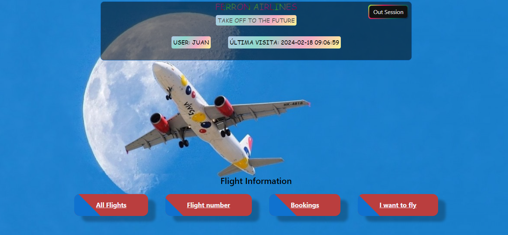

# Gestión de Vuelos

¡Bienvenido/a  a mi aplicaciçon de gestion de reservas de Vuelos

Esta aplicación web utiliza programación orientada a objetos (POO) y sigue el patrón de arquitectura Modelo-Vista-Controlador (MVC) para proporcionar funcionalidades a administradores y usuarios. Incluye servicios como mostrar la lista completa de todos los vuelos.  Gestión de pasajes, busqueda por identificador  y mucho más...

La aplicación  hace uso de sesiones y cookies para una mejor experiencia y seguridad.

## Funcionalidades

- Visualizar todos los vuelos con información detallada
- Modificar vuelos
- Busqeuda de vuelos
- Visualizacion de un pasaje
- Actualizacion y/o borrado de un pasaje

### Sesiones y Cookies

- Uso de sesiones y cookies para el seguimiento de la última conexión
- Uso de sesiones para mantener al usuario autentificado.

## Tecnologías Utilizadas

- **Frontend:**   
- **Backend:**  

## Creador del Proyecto

- Juan Ferron (in/juanferron)

## Instalación

1. Clona este repositorio: `git clone https://github.com/ferronmol/serviciosVuelos.git`
2. Navega a la carpeta del proyecto: `cd serviciosVuelos`
3. Léer el archivo de uso.
4. Abre el archivo `index.php` en tu navegador.

## Contribuciones

¡Estamos abiertos a contribuciones! Si encuentras algún problema o tienes sugerencias, por favor, crea un [issue](https://github.com/ferronmol/serviciosVuelos/issues) o envía una [pull request](https://github.com/ferronmol/serviciosVuelos/pulls).

Gracias Luismi por tu gran contribución al enseñarme!

## Licencia

Este proyecto está bajo la Licencia MIT. Consulta el archivo [LICENSE](LICENSE) para más detalles.
